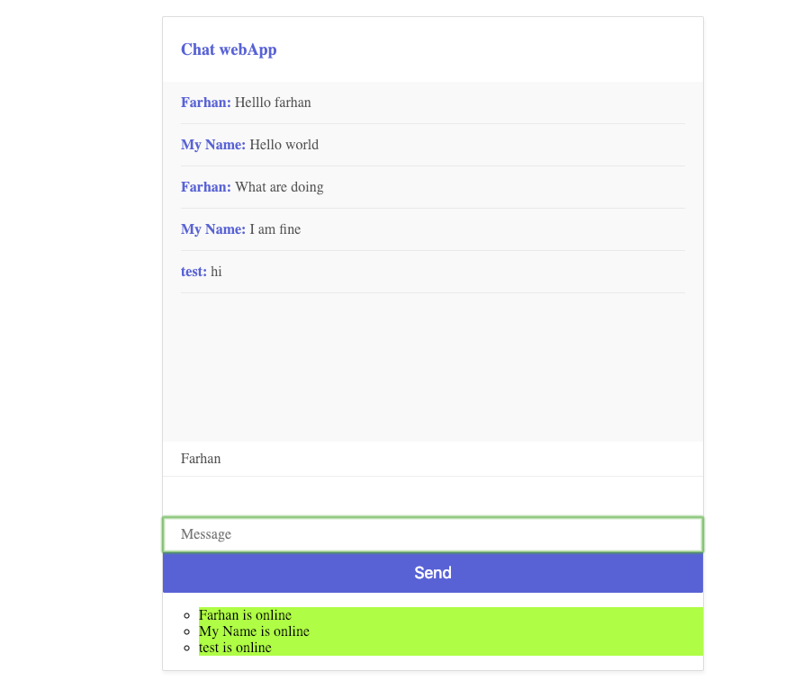

## Simple Chating Webapp
This is webapp is for chating using browser, only need a name to enter in the room. 
Open chat without private messages.

Docker image available now...
`docker pull farhanjii/chat-app:latest`

#### Upcoming Features
Private chats
sending files, images, offline and online functions, admin controll panel. Auto restriction Abusing/badwords.
Blocking and unblocking of ip.
 
### live demo
http://chat-app-lite.herokuapp.com/

### Screen Shot

  

